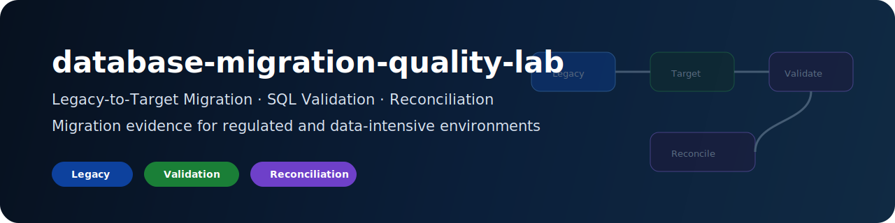
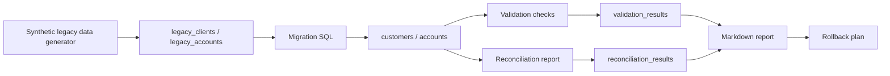

# database-migration-quality-lab

<div align="center">



<br/>

**Legacy-to-target data migration lab with SQL validation, reconciliation and rollback documentation**

PostgreSQL · SQL · Python · Data Quality · Migration · Reconciliation · Rollback


</div>

---

## Executive summary

`database-migration-quality-lab` is a public technical portfolio project demonstrating how to migrate synthetic legacy financial-style data into a target normalized schema, validate the migration and generate reconciliation evidence.

```text
legacy schema -> synthetic source data -> migration SQL -> target schema -> validation checks -> reconciliation report -> rollback plan
```

The project is designed for regulated and data-intensive environments: banks, insurers, health insurers, reinsurance, financial infrastructure, consulting, data-platform teams and legacy-to-modern transformation programs.

No real banking, insurance, health, client, employer or private data belongs here.

---

## Target roles

| Role family | Why this project helps |
|---|---|
| Junior Data Engineer | relational schema, SQL migration, Python automation |
| Data Migration Engineer | source-to-target mapping, validation, reconciliation |
| Database / Data Quality Analyst | controls, row counts, balance checks, referential integrity |
| Application & Data Support | incident triage and rollback documentation |
| Core banking / insurance IT | legacy-to-modern data handling and auditability |
| Consulting / integration | migration strategy, handover and evidence pack |

---

## Architecture



---

## Quickstart

```bash
make install
make generate
make test
make lint
```

With Docker / PostgreSQL:

```bash
make up
make load-legacy
make migrate
make validate
make reconcile
make report
```

Reset local environment:

```bash
make reset
```

---

## Repository structure

```text
database-migration-quality-lab/
├── README.md
├── PORTFOLIO.md
├── LICENSE
├── .gitignore
├── .env.example
├── pyproject.toml
├── Makefile
├── docker-compose.yml
├── assets/
│   └── database-migration-banner.svg
├── .github/workflows/ci.yml
├── data/
├── sql/
├── src/migration_quality/
├── tests/
├── docs/
├── reports/
└── output/
```

---

## Public-safety rules

- synthetic data only;
- no real bank, insurance, health, client, employer or private data;
- no production migration claims;
- no secrets or private infrastructure identifiers;
- no CVs, cover letters, job trackers or salary targets.

---

## Portfolio signal

This repository proves the ability to reason about legacy-to-target migration, SQL validation, reconciliation, rollback and documentation in regulated-data environments.
