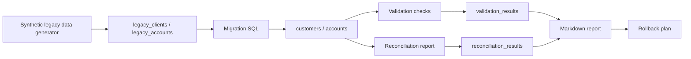

# database-migration-quality-lab

<div align="center">


<br/>

**Legacy-to-target data migration lab with SQL validation, reconciliation and rollback documentation**

PostgreSQL / SQL / Python / Data Quality / Migration / Reconciliation / Rollback


[](https://github.com/KinSushi/database-migration-quality-lab/actions)


</div>

---

## Executive summary

`database-migration-quality-lab` is a public technical portfolio project demonstrating how to migrate synthetic legacy financial-style data into a target normalized schema, validate the migration and generate reconciliation evidence.

```text
legacy schema -> synthetic source data -> migration SQL -> target schema -> validation checks -> reconciliation report -> rollback plan
```

The project is designed for regulated and data-intensive environments: banks, insurers, health insurers, reinsurance, financial infrastructure, consulting, data-platform teams and legacy-to-modern transformation programs.

No real banking, insurance, health, client, employer or private data belongs here.

---

## Validation evidence

Generated validation artifacts are available in:

- [docs/local_run_report.md](docs/local_run_report.md)
- [docs/screenshots.md](docs/screenshots.md)
- [docs/VALIDATION.md](docs/VALIDATION.md)

Current public validation covers:

```text
pip install
python -m compileall
pytest
ruff
synthetic legacy data generation
package import checks
```

The latest report shows `pytest`, `ruff`, synthetic legacy data generation and import checks passing.

---

## What a migration run produces (synthetic data)

The pipeline migrates a legacy schema to a target schema and proves correctness with reconciliation, not assumptions:

| Stage | Output |
|---|---|
| Legacy generation | synthetic source dataset with realistic anomalies |
| Migration | target schema populated via documented SQL |
| Validation | row counts, checksums and referential-integrity checks |
| Reconciliation | source-vs-target deltas reported in `reports/` |
| Rollback | documented reset/rollback path so the run is repeatable |

Reproduce locally with the Quickstart commands. Every record is **synthetic**; no real database content is included.

---

## Target roles

| Role family | Why this project helps |
|---|---|
| Data Engineer | relational schema, SQL migration, Python automation |
| Data Migration Engineer | source-to-target mapping, validation, reconciliation |
| Database / Data Quality Analyst | controls, row counts, balance checks, referential integrity |
| Application & Data Support | incident triage and rollback documentation |
| Core banking / insurance IT | legacy-to-modern data handling and auditability |
| Consulting / integration | migration strategy, handover and evidence pack |

---

## Architecture



---

## Quickstart

```bash
make install
make generate
make test
make lint
```

With Docker / PostgreSQL:

```bash
make up
make load-legacy
make migrate
make validate
make reconcile
make report
```

Reset local environment:

```bash
make reset
```

---

## Repository structure

```text
database-migration-quality-lab/
|-- README.md
|-- PORTFOLIO.md
|-- LICENSE
|-- .env.example
|-- pyproject.toml
|-- Makefile
|-- docker-compose.yml
|-- assets/
|-- .github/workflows/
|-- data/
|-- sql/
|-- src/migration_quality/
|-- tests/
|-- docs/
|-- reports/
`-- output/
```

---

## Public-safety rules

- synthetic data only;
- no real bank, insurance, health, client, employer or private data;
- no production migration claims;
- no secrets or private infrastructure identifiers;
- no CVs, cover letters, job trackers or salary targets.

---

## Portfolio signal

This repository proves the ability to reason about legacy-to-target migration, SQL validation, reconciliation, rollback and documentation in regulated-data environments.

---

## Portfolio layer

This repository is part of the KinSushi public technical portfolio.

| Layer | Evidence |
|---|---|
| Data migration | legacy schema, target schema, migration SQL, validation, reconciliation, rollback |

Detailed cross-repository context: [docs/PORTFOLIO_LAYER.md](docs/PORTFOLIO_LAYER.md)
# database-migration-quality-lab

<div align="center">


<br/>

**Legacy-to-target data migration lab with SQL validation, reconciliation and rollback documentation**

PostgreSQL / SQL / Python / Data Quality / Migration / Reconciliation / Rollback


[](https://github.com/KinSushi/database-migration-quality-lab/actions)


</div>

---

## Executive summary

`database-migration-quality-lab` is a public technical portfolio project demonstrating how to migrate synthetic legacy financial-style data into a target normalized schema, validate the migration and generate reconciliation evidence.

```text
legacy schema -> synthetic source data -> migration SQL -> target schema -> validation checks -> reconciliation report -> rollback plan
```

The project is designed for regulated and data-intensive environments: banks, insurers, health insurers, reinsurance, financial infrastructure, consulting, data-platform teams and legacy-to-modern transformation programs.

No real banking, insurance, health, client, employer or private data belongs here.

---

## Validation evidence

Generated validation artifacts are available in:

- [docs/local_run_report.md](docs/local_run_report.md)
- [docs/screenshots.md](docs/screenshots.md)
- [docs/VALIDATION.md](docs/VALIDATION.md)

Current public validation covers:

```text
pip install
python -m compileall
pytest
ruff
synthetic legacy data generation
package import checks
```

The latest report shows `pytest`, `ruff`, synthetic legacy data generation and import checks passing.

---

## What a migration run produces (synthetic data)

The pipeline migrates a legacy schema to a target schema and proves correctness with reconciliation, not assumptions:

| Stage | Output |
|---|---|
| Legacy generation | synthetic source dataset with realistic anomalies |
| Migration | target schema populated via documented SQL |
| Validation | row counts, checksums and referential-integrity checks |
| Reconciliation | source-vs-target deltas reported in `reports/` |
| Rollback | documented reset/rollback path so the run is repeatable |

Reproduce locally with the Quickstart commands. Every record is **synthetic**; no real database content is included.

---

## Target roles

| Role family | Why this project helps |
|---|---|
| Data Engineer | relational schema, SQL migration, Python automation |
| Data Migration Engineer | source-to-target mapping, validation, reconciliation |
| Database / Data Quality Analyst | controls, row counts, balance checks, referential integrity |
| Application & Data Support | incident triage and rollback documentation |
| Core banking / insurance IT | legacy-to-modern data handling and auditability |
| Consulting / integration | migration strategy, handover and evidence pack |

---

## Architecture


---

## Quickstart

```bash
make install
make generate
make test
make lint
```

With Docker / PostgreSQL:

```bash
make up
make load-legacy
make migrate
make validate
make reconcile
make report
```

Reset local environment:

```bash
make reset
```

---

## Repository structure

```text
database-migration-quality-lab/
|-- README.md
|-- PORTFOLIO.md
|-- LICENSE
|-- .env.example
|-- pyproject.toml
|-- Makefile
|-- docker-compose.yml
|-- assets/
|-- .github/workflows/
|-- data/
|-- sql/
|-- src/migration_quality/
|-- tests/
|-- docs/
|-- reports/
`-- output/
```

---

## Public-safety rules

- synthetic data only;
- no real bank, insurance, health, client, employer or private data;
- no production migration claims;
- no secrets or private infrastructure identifiers;
- no CVs, cover letters, job trackers or salary targets.

---

## Portfolio signal

This repository proves the ability to reason about legacy-to-target migration, SQL validation, reconciliation, rollback and documentation in regulated-data environments.

---

## Portfolio layer

This repository is part of the KinSushi public technical portfolio.

| Layer | Evidence |
|---|---|
| Data migration | legacy schema, target schema, migration SQL, validation, reconciliation, rollback |

Detailed cross-repository context: [docs/PORTFOLIO_LAYER.md](docs/PORTFOLIO_LAYER.md)
# database-migration-quality-lab

<div align="center">


<br/>

**Legacy-to-target data migration lab with SQL validation, reconciliation and rollback documentation**

PostgreSQL / SQL / Python / Data Quality / Migration / Reconciliation / Rollback


[](https://github.com/KinSushi/database-migration-quality-lab/actions)


</div>

---

## Executive summary

`database-migration-quality-lab` is a public technical portfolio project demonstrating how to migrate synthetic legacy financial-style data into a target normalized schema, validate the migration and generate reconciliation evidence.

```text
legacy schema -> synthetic source data -> migration SQL -> target schema -> validation checks -> reconciliation report -> rollback plan
```

The project is designed for regulated and data-intensive environments: banks, insurers, health insurers, reinsurance, financial infrastructure, consulting, data-platform teams and legacy-to-modern transformation programs.

No real banking, insurance, health, client, employer or private data belongs here.

---

## Validation evidence

Generated validation artifacts are available in:

- [docs/local_run_report.md](docs/local_run_report.md)
- [docs/screenshots.md](docs/screenshots.md)
- [docs/VALIDATION.md](docs/VALIDATION.md)

Current public validation covers:

```text
pip install
python -m compileall
pytest
ruff
synthetic legacy data generation
package import checks
```

The latest report shows `pytest`, `ruff`, synthetic legacy data generation and import checks passing.

---

## What a migration run produces (synthetic data)

The pipeline migrates a legacy schema to a target schema and proves correctness with reconciliation, not assumptions:

| Stage | Output |
|---|---|
| Legacy generation | synthetic source dataset with realistic anomalies |
| Migration | target schema populated via documented SQL |
| Validation | row counts, checksums and referential-integrity checks |
| Reconciliation | source-vs-target deltas reported in `reports/` |
| Rollback | documented reset/rollback path so the run is repeatable |

Reproduce locally with the Quickstart commands. Every record is **synthetic**; no real database content is included.

---

## Target roles

| Role family | Why this project helps |
|---|---|
| Data Engineer | relational schema, SQL migration, Python automation |
| Data Migration Engineer | source-to-target mapping, validation, reconciliation |
| Database / Data Quality Analyst | controls, row counts, balance checks, referential integrity |
| Application & Data Support | incident triage and rollback documentation |
| Core banking / insurance IT | legacy-to-modern data handling and auditability |
| Consulting / integration | migration strategy, handover and evidence pack |

---

## Architecture


---

## Quickstart

```bash
make install
make generate
make test
make lint
```

With Docker / PostgreSQL:

```bash
make up
make load-legacy
make migrate
make validate
make reconcile
make report
```

Reset local environment:

```bash
make reset
```

---

## Repository structure

```text
database-migration-quality-lab/
|-- README.md
|-- PORTFOLIO.md
|-- LICENSE
|-- .env.example
|-- pyproject.toml
|-- Makefile
|-- docker-compose.yml
|-- assets/
|-- .github/workflows/
|-- data/
|-- sql/
|-- src/migration_quality/
|-- tests/
|-- docs/
|-- reports/
`-- output/
```

---

## Public-safety rules

- synthetic data only;
- no real bank, insurance, health, client, employer or private data;
- no production migration claims;
- no secrets or private infrastructure identifiers;
- no CVs, cover letters, job trackers or salary targets.

---

## Portfolio signal

This repository proves the ability to reason about legacy-to-target migration, SQL validation, reconciliation, rollback and documentation in regulated-data environments.

---

## Portfolio layer

This repository is part of the KinSushi public technical portfolio.

| Layer | Evidence |
|---|---|
| Data migration | legacy schema, target schema, migration SQL, validation, reconciliation, rollback |

Detailed cross-repository context: [docs/PORTFOLIO_LAYER.md](docs/PORTFOLIO_LAYER.md)
# database-migration-quality-lab

<div align="center">


<br/>

**Legacy-to-target data migration lab with SQL validation, reconciliation and rollback documentation**

PostgreSQL / SQL / Python / Data Quality / Migration / Reconciliation / Rollback


[](https://github.com/KinSushi/database-migration-quality-lab/actions)


</div>

---

## Executive summary

`database-migration-quality-lab` is a public technical portfolio project demonstrating how to migrate synthetic legacy financial-style data into a target normalized schema, validate the migration and generate reconciliation evidence.

```text
legacy schema -> synthetic source data -> migration SQL -> target schema -> validation checks -> reconciliation report -> rollback plan
```

The project is designed for regulated and data-intensive environments: banks, insurers, health insurers, reinsurance, financial infrastructure, consulting, data-platform teams and legacy-to-modern transformation programs.

No real banking, insurance, health, client, employer or private data belongs here.

---

## Validation evidence

Generated validation artifacts are available in:

- [docs/local_run_report.md](docs/local_run_report.md)
- [docs/screenshots.md](docs/screenshots.md)
- [docs/VALIDATION.md](docs/VALIDATION.md)

Current public validation covers:

```text
pip install
python -m compileall
pytest
ruff
synthetic legacy data generation
package import checks
```

The latest report shows `pytest`, `ruff`, synthetic legacy data generation and import checks passing.

---

## What a migration run produces (synthetic data)

The pipeline migrates a legacy schema to a target schema and proves correctness with reconciliation, not assumptions:

| Stage | Output |
|---|---|
| Legacy generation | synthetic source dataset with realistic anomalies |
| Migration | target schema populated via documented SQL |
| Validation | row counts, checksums and referential-integrity checks |
| Reconciliation | source-vs-target deltas reported in `reports/` |
| Rollback | documented reset/rollback path so the run is repeatable |

Reproduce locally with the Quickstart commands. Every record is **synthetic**; no real database content is included.

---

## Target roles

| Role family | Why this project helps |
|---|---|
| Junior Data Engineer | relational schema, SQL migration, Python automation |
| Data Migration Engineer | source-to-target mapping, validation, reconciliation |
| Database / Data Quality Analyst | controls, row counts, balance checks, referential integrity |
| Application & Data Support | incident triage and rollback documentation |
| Core banking / insurance IT | legacy-to-modern data handling and auditability |
| Consulting / integration | migration strategy, handover and evidence pack |

---

## Architecture


---

## Quickstart

```bash
make install
make generate
make test
make lint
```

With Docker / PostgreSQL:

```bash
make up
make load-legacy
make migrate
make validate
make reconcile
make report
```

Reset local environment:

```bash
make reset
```

---

## Repository structure

```text
database-migration-quality-lab/
|-- README.md
|-- PORTFOLIO.md
|-- LICENSE
|-- .env.example
|-- pyproject.toml
|-- Makefile
|-- docker-compose.yml
|-- assets/
|-- .github/workflows/
|-- data/
|-- sql/
|-- src/migration_quality/
|-- tests/
|-- docs/
|-- reports/
`-- output/
```

---

## Public-safety rules

- synthetic data only;
- no real bank, insurance, health, client, employer or private data;
- no production migration claims;
- no secrets or private infrastructure identifiers;
- no CVs, cover letters, job trackers or salary targets.

---

## Portfolio signal

This repository proves the ability to reason about legacy-to-target migration, SQL validation, reconciliation, rollback and documentation in regulated-data environments.

---

## Portfolio layer

This repository is part of the KinSushi public technical portfolio.

| Layer | Evidence |
|---|---|
| Data migration | legacy schema, target schema, migration SQL, validation, reconciliation, rollback |

Detailed cross-repository context: [docs/PORTFOLIO_LAYER.md](docs/PORTFOLIO_LAYER.md)
