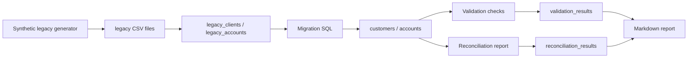

# Architecture — database-migration-quality-lab

```mermaid
flowchart LR
    A[Synthetic legacy generator] --> B[legacy CSV files]
    B --> C[legacy_clients / legacy_accounts]
    C --> D[Migration SQL]
    D --> E[customers / accounts]
    E --> F[Validation checks]
    E --> G[Reconciliation report]
    F --> H[validation_results]
    G --> I[reconciliation_results]
    H --> J[Markdown report]
    I --> J
```

## Public-safety boundary

Synthetic data only. No real client, bank, insurance, health, employer or private data.
